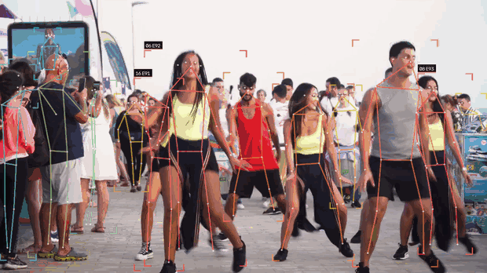
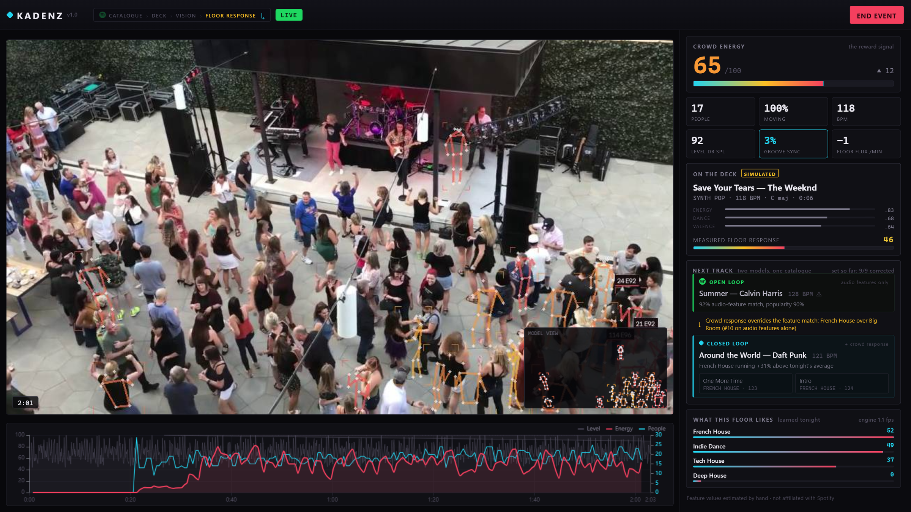
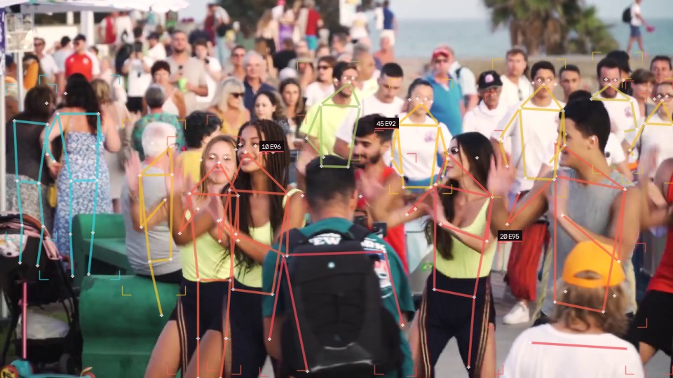

# Kadenz `v1.0`

**A camera that reads the dancefloor — and closes the loop a music recommender can't.**

> First public version. The vision pipeline and the closed-loop recommender both
> work end to end; the roadmap below is what v1.1 is for.



<sub>Rooftop club. The front rows are tracked; the packed crowd behind them is not — at that distance people are a few pixels tall and a person detector cannot see them at all (see <a href="#limitations">Limitations</a>).</sub>

### ▶ [Try it on your own camera — no install](https://mathieutellene.github.io/kadenz/)

The whole loop also runs **client-side in a browser**: the same YOLOv8-pose
weights exported to ONNX, the same recommender, both models ranking side by
side. Nothing is uploaded — there is no server in that build at all. Point it at
yourself and watch the closed loop learn what moves *you*.

---

## The problem: recommendation is an open loop

 **Spotify's**
recommender is extremely good at one question — *given this track, what sounds
like it?* It answers from audio features (`energy`, `danceability`, `valence`,
`tempo`, `key`) plus what millions of other listeners did next. It is the best
open-loop music model ever built.

But it is **open loop**. It knows what was played. It never finds out whether
the floor emptied.

A DJ closes that loop by eye, every twenty seconds, all night. **Kadenz closes
it with computer vision** — the same catalogue, the same audio features, but
re-ranked by the one signal nobody has: *how the crowd actually reacted,
measured in real time.*

```
       ┌────────────────────── the loop ──────────────────────┐
       │                                                      │
       ▼                                                      │
┌────────────┐     ┌─────────┐     ┌───────────┐     ┌────────┴───────┐
│  SPOTIFY   │────▶│  DECK   │────▶│  VISION   │────▶│ CROWD RESPONSE │
│ catalogue  │     │  track  │     │ YOLO-pose │     │  reward 0-100  │
│ + features │     │ playing │     │ + optflow │     │   per track    │
└────────────┘     └─────────┘     └───────────┘     └────────────────┘
└─ an open-loop recommender ─┘     └──────── what Kadenz adds ────────┘
```

<sub>Kadenz is not affiliated with or endorsed by Spotify, or by any artist or
label named in the catalogue. The tracks are real; their audio-feature values
are estimates assigned by hand, not retrieved from any provider — see
<a href="#what-is-real-and-what-is-simulated">What is real</a>.</sub>

Everything runs locally on a laptop CPU. No GPU, no cloud, no per-frame API calls.

---

## Both models run at once, and you can watch them disagree

`engine/dj.py` computes **two rankings of the same catalogue on every track
change**, so the premise is testable instead of merely asserted:

| | ranks by | sees the room? |
|---|---|---|
| `recommend_open()` — **open loop** | audio-feature similarity to what's playing + popularity prior | ❌ |
| `recommend()` — **closed loop** | the crowd response *this floor* gave each genre and tempo band tonight | ✅ |

A ten-track simulated set against a floor that wants tech house and does not
want pop (`scripts/sim_loop.py`):

```
#  CLOSED LOOP PLAYED                              resp      Δ   OPEN LOOP WANTED INSTEAD
───────────────────────────────────────────────────────────────────────────────────────────────────
 1  Don't You Know — Kungs                            62           Blinding Lights ◆
 2  Losing It — Fisher                                86    +39%   Blinding Lights ◆
 3  Stop It — Fisher                                  85    +16%   Blinding Lights ◆
 4  Gecko (Overdrive) — Oliver Heldens                70    -10%   Blinding Lights ◆
 5  WTF — HUGEL                                       88    +16%   Blinding Lights ◆
 6  Morenita — HUGEL                                  88    +12%   Blinding Lights ◆
 7  I Follow Rivers (The Magician Remix) — Lykke Li   42    -48%   Blinding Lights ◆
 8  I'm Good (Blue) — David Guetta & Bebe Rexha       48    -36%   Blinding Lights ◆
 9  One More Time — Daft Punk                         76     +7%   Blinding Lights ◆
10  Around the World — Daft Punk                      76     +6%   Blinding Lights ◆
───────────────────────────────────────────────────────────────────────────────────────────────────
divergence: 100% — 10 of 10 picks corrected by the crowd
final call: French House over Synthwave (#12 on audio features alone)
```

Two things to notice, and they are the whole argument:

1. **The open loop asks for *Blinding Lights* ten times out of ten.** It carries
   the highest popularity in the catalogue, so it wins every round — and at
   171 BPM it cannot be beatmatched from anything else in the set, which the
   content model has no way to know. That is not a strawman: it is popularity
   bias, the known failure mode of content-plus-popularity recommenders,
   reproduced faithfully.
2. **The closed loop explores, then commits.** It pays for information early and
   late — *I Follow Rivers* at −48%, *I'm Good (Blue)* at −36% — and in between
   finds what this room is actually here for: Fisher and HUGEL at 86–88. The
   genre it settles on ranks **#12 of 17** on audio features alone. No
   open-loop model would ever reach it.

The genre table it learned, from nothing, in ten tracks — note that it also
learned what *not* to play, which is the half a recommender never finds out:

```
  Tech House        86.7     French House      75.7
  Future House      70.1     Deep House        61.6
  Big Room          47.6     Indie Dance       41.8
```

---

## The dashboard



Left: the footage with hairline pose overlays and a picture-in-picture of what
the model actually sees. Right: the live read of the room — and the two
recommenders stacked, open loop above, closed loop below, with the crowd's
verdict between them.

---

## What it measures

| Metric | What it answers | How |
|---|---|---|
| **Crowd energy** | How hard is the room going? | Dense optical flow inside person boxes, ranked against the session's own history (auto-calibrating, 0–100). **This is the reward signal.** |
| **People** | How many are on the floor? | YOLOv8-pose detection + ByteTrack identities |
| **Moving %** | Are they dancing or just standing? | Share of tracked people whose local motion clears a threshold |
| **Floor flux** | Is the floor filling or emptying? | Confirmed track entries minus exits per minute |
| **Groove sync** ⭐ | Do they move *with* the music, or just move? | Rolling Pearson correlation between motion energy and the audio onset envelope, searched over ±1.5 s of lag |
| **Level (dB SPL)** | How loud is the room? | RMS mapped to an SPL estimate (a laptop mic is not a calibrated meter — see *What is real*) |
| **Per-person energy** | Who is actually going off? | Same flow signal restricted to each person's box, percentile-ranked across the session |

Colour means the same thing everywhere — overlays, meters and charts share one
ramp: **cyan = still → amber → hot pink = going off.**



*Night stage. The people sitting on the steps in the foreground come out cold;
the ones dancing come out warm. Nobody labelled that — the split falls out of
the motion measurement alone, and the colour ramp is doing all the work.*

---

## How the loop is implemented

**The reward.** Every track holds the deck for a fixed span. Throughout, the
vision pipeline samples crowd energy at 2 Hz; on track change those samples are
averaged into a single scalar — the reward that track earned from *this* room —
and compared against the session's running mean to produce a `Δ%`.

**The policy.** Contextual-bandit style. Rewards accumulate into two tables,
genre and 5-BPM tempo band. The next pick maximises expected response:

```
score = 0.55·genre_reward + 0.30·tempo_reward + 15·danceability
        − 120·max(0, bpm_drift − 6%)      ← unmixable tracks are unusable
        − 25 if already played            ← don't repeat the set
        + U(0, 4)                         ← exploration: keep sampling
```

The `±6%` term is not a heuristic pulled from nowhere — it is the range a DJ can
beatmatch without audible artefacts. A recommender that ignores it produces
suggestions no human can actually mix.

**The explanation.** Every pick ships with the sentence that justifies it
(*"Tech House running +39% above tonight's average"*). A DJ will not take an
instruction from a black box mid-set, so the engine argues its case.

---

## How it runs

Three loops at their own pace, so the video never waits for the model:

```
  capture ──▶ DISPLAY THREAD   decode, scale once, draw last known state, 18 fps
                  │                      ▲
                  ▼                      │ shared state
              ANALYSIS THREAD   YOLOv8-pose + ByteTrack + Farnebäck optical flow
                  │
              AUDIO THREAD      BPM, onset envelope, drops, level (librosa)
                  │
              METRICS 2 Hz ──▶ DJ engine ──▶ WebSocket ──▶ browser
```

Frames go over the WebSocket as binary (4-byte timestamp + JPEG) on a
**latest-wins** slot — if the browser falls behind, frames are dropped rather
than queued, so playback never accumulates lag. Everything else is JSON.

**Stack:** Python · PyTorch · Ultralytics YOLOv8-pose · ByteTrack (supervision) ·
OpenCV · librosa · FastAPI + WebSockets · ECharts.

---

## Run it

```bash
python -m venv .venv
.venv/Scripts/pip install -r requirements.txt     # Linux/macOS: .venv/bin/pip
python run.py                                     # -> http://127.0.0.1:8765
```

Model weights (~7 MB) download on first run into `models/`. Click **START
EVENT** and pick any video of a crowd. Nothing is stored: uploads are wiped on
start and on each new file.

Watch the recommender reason on its own, no camera needed:

```bash
python scripts/sim_loop.py               # the open-vs-closed table above
python -m engine.selftest clip.mp4 30    # headless vision check
```

**Detection size is the main quality/speed dial** (`det_imgsz` in `config.yaml`).
On the demo clip, measured on a laptop CPU with no GPU:

| `det_imgsz` | People found | Inference |
|---|---|---|
| 640 | ~15 | ~90 ms |
| **960 (default)** | **~20** | ~180 ms |
| 1280 (crowd mode) | ~27–34 | ~240 ms |

The stills in this README use crowd mode. Because display and analysis run on
separate threads, raising it costs detection latency, never video smoothness.

Live camera mode exists (`{"type":"start","webcam":true}` over the WebSocket,
`webcam_index` in `config.yaml`) and captures system audio or the mic on Windows
via WASAPI loopback, which enables real BPM, real Shazam track ID and real
Groove Sync.

---

## The browser build

[`mathieutellene.github.io/kadenz`](https://mathieutellene.github.io/kadenz/) is
the same loop with no Python, no install and no server: `docs/` is a static page
that runs the pose model on the visitor's own camera and keeps every frame on
their machine.

| | desktop | browser |
|---|---|---|
| Detector | YOLOv8-pose (PyTorch) | the same weights, exported to ONNX, run by onnxruntime-web on WebGPU or WASM |
| Tracker | ByteTrack | greedy IoU association |
| Motion | Farnebäck dense optical flow | per-box frame differencing |
| Audio | librosa + Shazam | Web Audio spectral flux (BPM, level, groove sync) |
| Recommender | `engine/dj.py` | `docs/dj.js` — a port, with the catalogue **generated** from the Python by `scripts/build_catalogue.py` so the two cannot drift |

Measured in-browser on a laptop with no GPU, single-threaded WASM — the floor
everyone lands on, because GitHub Pages cannot send the COOP/COEP headers that
would unlock WASM threads:

| detection size | people found on the demo frame | inference |
|---|---|---|
| **320 (default)** | 3 | ~165 ms |
| 640 (crowd mode, a second 13 MB download) | 12 | ~400 ms |

Same quality/speed dial as `det_imgsz`, same shape of trade-off, exposed as a
button in the top bar. With WebGPU available it is far faster than either.

The port is not taken on trust. Driven by the same synthetic floor, `docs/dj.js`
reaches the same conclusions as `scripts/sim_loop.py`: the open loop asks for
*Blinding Lights* in all ten rounds, **10 of 10** picks are corrected, and the
learned genre table matches value for value — Tech House 88, French House 76,
Deep House 62, Big Room 48.

What does *not* match is which tracks get explored on the way there, because the
two languages cannot share a PRNG sequence and the exploration term draws from
it. That is the honest result and it is also the point of a bandit: the route
varies, the conclusion does not.

---

## What is real and what is simulated

Being explicit about this, because a demo that blurs the line is worthless:

| | Status |
|---|---|
| Person detection, tracking, pose, motion energy, occupancy, flux, per-person energy | **Real** — measured from the footage |
| Groove sync, BPM, drops, track ID (Shazam) | **Real when there is real audio.** Silent footage shows `n/a` rather than a number |
| **Both recommenders** — the open-loop ranking and the closed-loop re-ranking | **Real code, really executed.** Both rank the live catalogue on every track change; the divergence number is counted, not written |
| The tracks themselves | **Real releases**, used as recognisable labels — a DJ can tell at a glance whether a suggestion makes sense |
| Their audio-feature values | **Estimated by hand.** `bpm` and `key` are nominal; `energy`, `danceability`, `valence` and `popularity` were assigned by ear on the 0–1 scales a catalogue API uses. **They are not retrieved from Spotify or anywhere else**, and no claim is made that they match any provider's published values. Swap `CATALOGUE` for a real provider's response and nothing else changes |
| Level in dB SPL | **Estimated** — a laptop mic is not a calibrated SPL meter |

The crowd response that drives the loop is **measured for real** — that is the
half that matters, and the half that does not exist anywhere else. Estimated
values are tagged `SIMULATED` / `· sim` in amber in the UI, never presented as
measurements. Silent audio is rejected outright: analysing it would produce a
fabricated BPM.

---

## Limitations

- **Drone/overhead festival footage does not work.** People 2–3 px tall are
  invisible to a person detector — that needs density estimation
  (DM-Count/P2PNet), not detection. Measured: 0 detections across four aerial
  clips at every resolution tested.
- **Dark club footage is hard.** Backlit silhouettes under strobes are the worst
  case for COCO-trained detectors; an elevated, reasonably lit angle works far
  better. Strobe frames are gated out of the flow signal by a luminance check.
- Energy is **relative to the session**, not an absolute scale: 90 tonight is
  not comparable to 90 last night.
- The reward is **aggregate energy**, not preference. It cannot separate a floor
  that loves a track from a floor that is merely warm.
- Person IDs are anonymous integers that die with the session. No faces are
  stored, no identity is computed, only aggregates leave the engine.

## Roadmap to v1.1

- A real catalogue behind the same interface — `CATALOGUE` is the only seam.
- Density estimation for aerial footage, so festivals stop being a blind spot.
- Per-section rewards: the loop scores a whole track today, not the drop.

---

## License

**AGPL-3.0** — required, because this depends on Ultralytics YOLO, which is
AGPL-3.0. Swapping the detector for an Apache-2.0 model (RT-DETR, D-FINE) would
allow a permissive licence.

Demo footage: [Pixabay](https://pixabay.com/) content licence — one scene per
visual: rooftop club (the animation at the top), night stage (the per-person
still), open-air concert (the dashboard).

Track titles and artists in `engine/dj.py` are real releases, used as
recognisable labels. Their audio-feature values are not: see *What is real and
what is simulated*. No affiliation with, or endorsement by, any artist or label
is implied.
Spotify is a trademark of Spotify AB; the mark appears here to identify the
class of system Kadenz complements, and implies no affiliation or endorsement.
